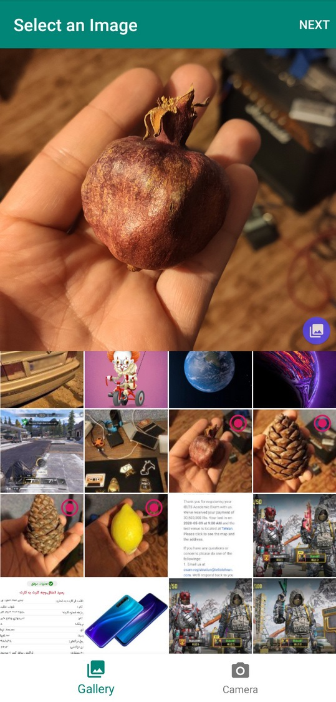
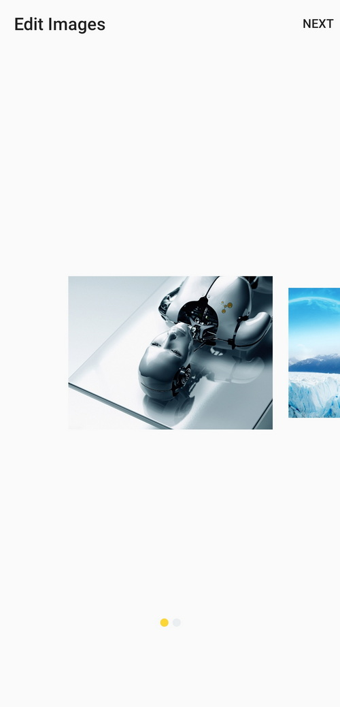
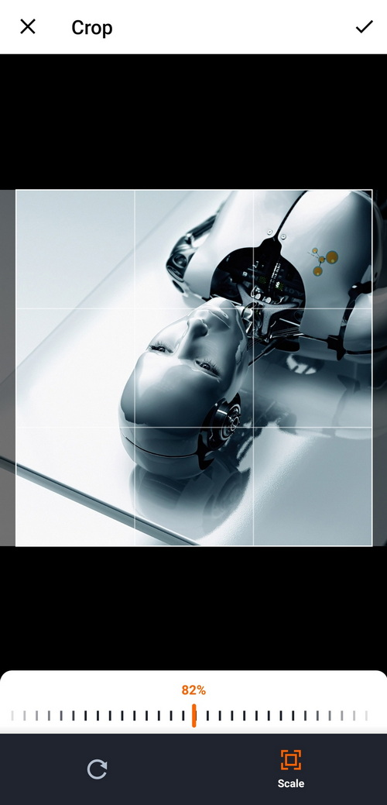
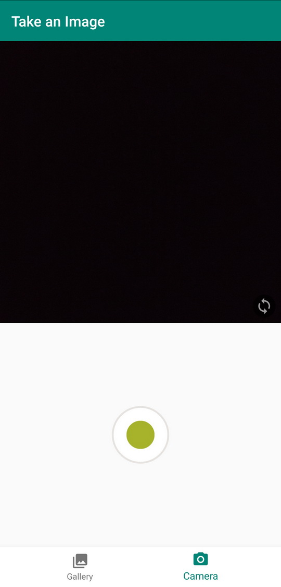

# InstagramPicker

InstagramPicker is an android library that lets you choose single/multi pictures from gallery or camera in style of Instagram.<br>
it manages permissions too. Camera and Write External Storage is used but you don't need to add this in your manifest file.

<p align="center">
  
  <br>
  
  
</p>

# Table of Contents
1. [Gradle Dependency](https://github.com/ShahabGT/InstagramPicker#gradle-dependency)<br>
2. [How to use it](https://github.com/ShahabGT/InstagramPicker#how-to-use-it)<br>
3. [Customization](https://github.com/ShahabGT/InstagramPicker#customization)<br>
4. [Built With](https://github.com/ShahabGT/InstagramPicker#built-with)<br>
5. [Developed By](https://github.com/ShahabGT/InstagramPicker#developed-by)<br>
5. [License](https://github.com/ShahabGT/InstagramPicker#license)<br>


# Gradle Dependency
Step 1. Add the JitPack repository to your build file <br>
Add it in your root build.gradle (project level) at the end of repositories:
```
	allprojects {
		repositories {
			...
			maven { url 'https://jitpack.io' }
		}
	}
```
Step 2. Add the dependency<br>
Add it in your dependencies section of build.gradle (app level):
```
	dependencies {
	        implementation 'com.github.ShahabGT:InstagramPicker:1.0.7'
	}
```
Step 3. It uses Java 8 so add these lines in build.gardle(app level) in the android tag:
```
 compileOptions {
        sourceCompatibility = 1.8
        targetCompatibility = 1.8
    }
```

Step 4. Add these activities in your manifest file. in the application tag:
```
<activity android:name="ir.shahabazimi.instagrampicker.gallery.SelectActivity" />
<activity android:name="ir.shahabazimi.instagrampicker.filter.FilterActivity" />
<activity android:name="ir.shahabazimi.instagrampicker.gallery.MultiSelectActivity"/>
<activity
	android:name="com.theartofdev.edmodo.cropper.CropImageActivity"
	android:theme="@style/Base.Theme.AppCompat" />
```


# How to use it
For using this library just use the code below it is simple and straight forward.
For single image selection use this:
```
InstagramPicker in = new InstagramPicker('Activity');
        in.show('X ratio','Y ratio', address ->  {

               //here you get your selected picture address in String format.
		// you can convert it to Uri if you want: Uri.parse();
			 

        });
```
For multi image selection use this:
```
InstagramPicker in = new InstagramPicker('Activity');
        in.show('X ratio','Y ratio','number of pics', addresses ->  {

               //here you get your selected pictures addresses in array of String
		// you can convert it to Uri if you want: Uri.parse();
			 

        });
```
X ratio, Y ratio= these two integer variables determines the crop aspect ratio of the picture.<br>
number of pics = an integer variable that determines the number of pictures that user allowed to pick, a number between 2 and 1000<br>
 
# Customization
you can customize the texts in the library using the cheatsheet below:
```
<string name="camera_permission_title">Camera Permission</string>
<string name="camera_permission_message">This permission is needed to Take Photos</string>
<string name="camera_permission_positive">allow</string>
<string name="camera_permission_negative">deny</string>
<string name="camera_permission_deny">Enable Permission in Settings</string>

<string name="storage_permission_title">External Storage Permission</string>
<string name="storage_permission_message">This permission is needed to read photos in your phone</string>
<string name="storage_permission_positive">allow</string>
<string name="storage_permission_negative">deny</string>
<string name="storage_permission_deny">Enable Permission in Settings</string>

<string name="instagrampicker_gallery">Gallery</string>
<string name="instagrampicker_gallery_title">Select an Image</string>

<string name="instagrampicker_camera">Camera</string>
<string name="instagrampicker_camera_title">Take an Image</string>

<string name="instagrampicker_multi_select_title">Edit Images</string>
<string name="instagrampicker_filter_title">Filters</string>
```
# Built With

[Ultra ViewPager](https://github.com/alibaba/UltraViewPager) UltraViewPager is an extension for ViewPager to provide multiple features in a single ViewPager.<br>
[Android-Image-Cropper](https://github.com/ArthurHub/Android-Image-Cropper) Image Cropping Library for Android, optimized for Camera / Gallery.<br>
[Picasso](https://github.com/square/picasso) A powerful image downloading and caching library for Android.<br>
[AndroidPhotoFilters](https://github.com/ravi8x/AndroidPhotoFilters)AndroidPhotoFilters aims to provide fast, powerful and flexible image processing instrument for creating awesome effects on any image media.

# Developed By

* Shahab Azimi
 * [shahabazimi.ir](http://shahabazimi.ir) - <azimishahab@gmail.com>

# License

    Copyright 2020 Shahab Azimi

    Licensed under the Apache License, Version 2.0 (the "License");
    you may not use this file except in compliance with the License.
    You may obtain a copy of the License at

       http://www.apache.org/licenses/LICENSE-2.0

    Unless required by applicable law or agreed to in writing, software
    distributed under the License is distributed on an "AS IS" BASIS,
    WITHOUT WARRANTIES OR CONDITIONS OF ANY KIND, either express or implied.
    See the License for the specific language governing permissions and
    limitations under the License.
